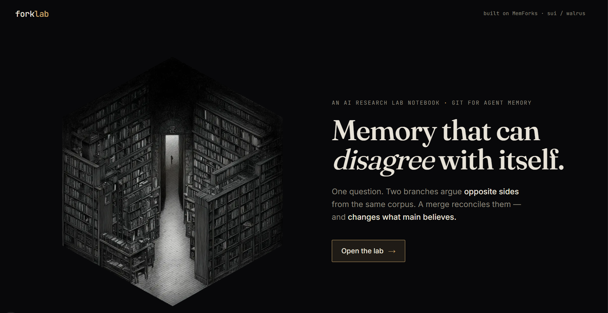

# forklab



An AI research-lab notebook built on **MemForks** (git-style branching memory on
Sui + Walrus). One question forks into two branches that argue opposite sides
from the same corpus; a merge reconciles them into a verdict committed back —
visibly changing what `main` knows.

## What it does

forklab turns a research question into an argument the memory has with itself,
then resolves it. The flow is four moves — **branch → diverge → critique →
merge**:

- **branch** — fork `research/main` into two opposing hypothesis branches,
  `hypothesis/pro` and `hypothesis/con`, both reading the same corpus.
- **diverge** — each branch builds the strongest case for its assigned stance.
  Divergence comes from the stance, not from cherry-picked evidence: both
  readers read the identical material.
- **critique** — each hypothesis gets a critic (`critique/pro`, `critique/con`)
  that rebuts it on its own terms.
- **merge** — a consensus step reconciles all four branches into a single
  verdict (what it accepts, what it rejects, its net position) and commits that
  verdict back to `research/main`.

The verdict is written as a real on-chain MemForks commit — it changes what the
memory holds, not just what the page displays.

## Why it's interesting

Most memory systems can only agree with themselves. forklab makes a memory that
can hold two contradictory positions at once, reason each one out in the open,
and then persist the reconciliation on chain — divergent reasoning made
inspectable, with the resolution durably written back. That's possible because
**MemForks** provides the branching-memory primitive underneath: real
branch / commit / recall / merge over Sui + Walrus, the same way git gives you
branches over a filesystem.

## Run it (no credentials needed)

The fastest way to see forklab work is mock mode — canned dev data, no backend
setup, no wallet:

```bash
git clone <your-fork-url> forklab
cd forklab
npm install
echo "MOCK_BACKEND=on" >> .env.local
npm run dev
```

Open <http://localhost:3000>.

Mock mode serves realistic canned responses so you can see the full divergence →
merge → verdict flow without MemForks credentials or a running backend. It is a
**dev harness**, gated to never run in production: the mock routes fire only when
`NODE_ENV !== "production"` **and** `MOCK_BACKEND === "on"`. In any other case the
real routes run unchanged.

### What to ask

forklab's corpus is fixed to one topic (see [Current scope](#current-scope-mvp)).
For a coherent run, ask:

> **Can small language models reliably use long-term memory?**

(or a close variant on the same small-models / long-term-memory topic).

Off-topic questions still read the same fixed corpus, so they produce incoherent
results — that's expected for the current MVP, not a bug.

### Run it live (real MemForks, on-chain)

Live mode performs real on-chain branch / commit / merge operations against
MemForks. Copy the example env file and fill in real values:

```bash
cp .env.example .env.local
```

| Variable                 | Purpose                                                                          |
| ------------------------ | -------------------------------------------------------------------------------- |
| `MEMFORK_TREE_ID`        | Object ID of your MemForks MemoryTree.                                            |
| `MEMFORK_PRIVATE_KEY`    | Sui signer private key (`suiprivkey…` bech32). Signs on-chain branch txs.         |
| `MEMFORK_MEMWAL_ACCOUNT` | MemWal account id (off-chain Walrus blob storage credential).                    |
| `MEMFORK_MEMWAL_KEY`     | MemWal delegate key, paired with the account id above.                           |
| `MEMFORK_NETWORK`        | Sui network: `mainnet` \| `testnet` \| `devnet` \| `localnet`. Defaults to `mainnet`. |
| `MEMFORK_RELAYER_URL`    | MemWal relayer endpoint (maps to `memwal.serverUrl`).                            |
| `MEMFORK_SPONSOR_URL`    | Sponsor service that makes on-chain branch txs gas-free; without it they self-pay and fail. |
| `MEMFORK_CHECKPOINTER`   | LangGraph checkpointer: `on` \| `off`. Off by default (it bypasses the MemWal throttle). |
| `MEMWAL_MIN_INTERVAL_MS` | Minimum spacing between MemWal requests, in ms. Defaults to `2200` (~27/min).    |
| `MODEL_PROVIDER`         | Model provider: `groq` \| `gemini` \| `ollama` (only `groq` is implemented).      |
| `MODEL_NAME`             | Model id passed to the provider, e.g. `llama-3.3-70b-versatile`.                  |
| `GROQ_API_KEY`           | Groq API key (Groq exposes an OpenAI-compatible endpoint).                        |
| `GEMINI_API_KEY`         | Optional fallback provider key — leave blank for now.                            |

Then run `npm run dev` and ask a question from the dashboard. A live run does
real on-chain work and is rate-limited, so expect **~1–2 minutes per run**.

## Architecture

- **Next.js 16** (App Router, TypeScript, Tailwind v4) — UI and the
  `/api/research` and `/api/merge` routes.
- **MemForks SDK** (`@memfork/core`, `@memfork/langgraph`) — branching memory
  (branch / commit / recall / merge) over Sui + Walrus —
  [memforks.dev](https://www.memforks.dev/).
- **Model** — Groq (`llama-3.3-70b-versatile`), provider-swappable via
  `MODEL_PROVIDER`.
- **LangGraph** — orchestrates the multi-agent divergence and critique graph.

Library map:

- [`src/lib/graph.ts`](src/lib/graph.ts) — the divergence engine (seed → readers
  → critics), runs under a per-run namespace.
- [`src/lib/merge.ts`](src/lib/merge.ts) — the consensus merge that produces and
  commits the verdict.
- [`src/lib/memfork.ts`](src/lib/memfork.ts) — the throttled MemForks client.
- [`src/lib/corpus.ts`](src/lib/corpus.ts) — the seed corpus.
- [`src/lib/model.ts`](src/lib/model.ts) — the provider-swappable model factory.

## How the merge proves a real memory change

The two API routes make the memory change inspectable. `POST /api/research`
returns a `runId` and the four diverged branches. `POST /api/merge` takes that
`runId` and returns both `mainBefore` and `mainAfter`:

- **`mainBefore`** — what `research/main` held before the merge: just the
  question and the corpus.
- **`mainAfter`** — what it holds after: the same, plus the reconciled verdict.

`mainBefore ≠ mainAfter`, and the difference is a real persisted on-chain commit
to `research/main` — verifiable on the MemForks side, not merely shown in the UI.

## Current scope (MVP)

forklab is an early product. The reasoning and the memory operations are real;
the source documents are seeded. Specifically:

- **Fixed corpus.** [`src/lib/corpus.ts`](src/lib/corpus.ts) holds six short,
  fake-but-credible paper abstracts about whether *small* (1B–3B parameter)
  language models can reliably use long-term memory. The evidence is
  deliberately mixed and not pre-sorted into pro/con — both readers read the same
  abstracts, and the divergence emerges from their stance prompts. Agents read
  this same corpus regardless of the question; real per-question paper ingestion
  is out of scope for now.
- **The corpus is mock, but the memory is not.** Every branch, commit, and merge
  is a real on-chain MemForks operation. The reasoning and the memory changes are
  real — only the source documents are seeded.
- **Rate limits.** Commits and recalls are throttled (~2.2s spacing), so a live
  run takes roughly 1–2 minutes.
- **Sponsor dependency.** Live mode depends on the MemForks sponsor service being
  healthy. When it's unavailable, forklab degrades honestly — the verdict is
  computed and the on-chain write is reported as pending — rather than crashing.

## License

`TODO: add a LICENSE file at the repo root and reference it here.`
